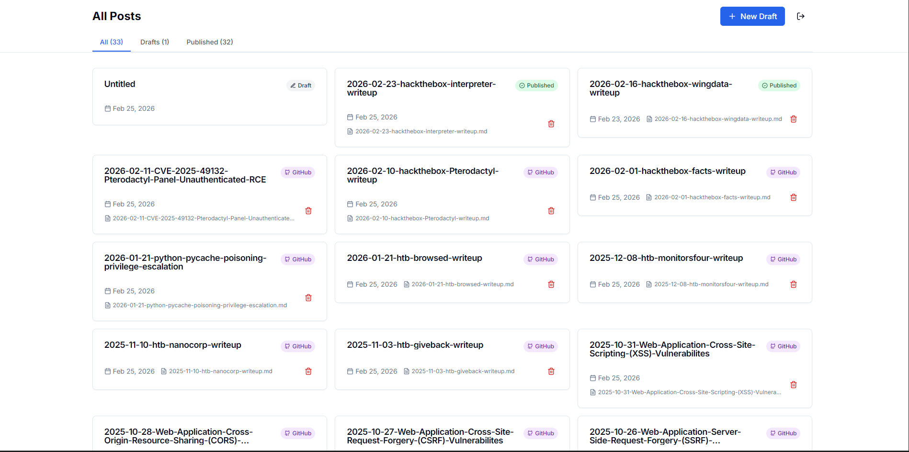
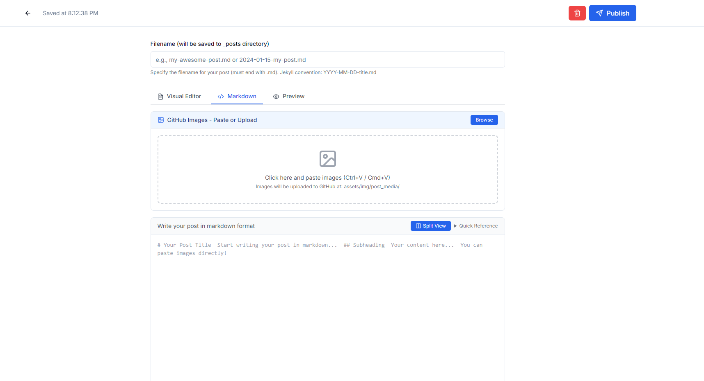
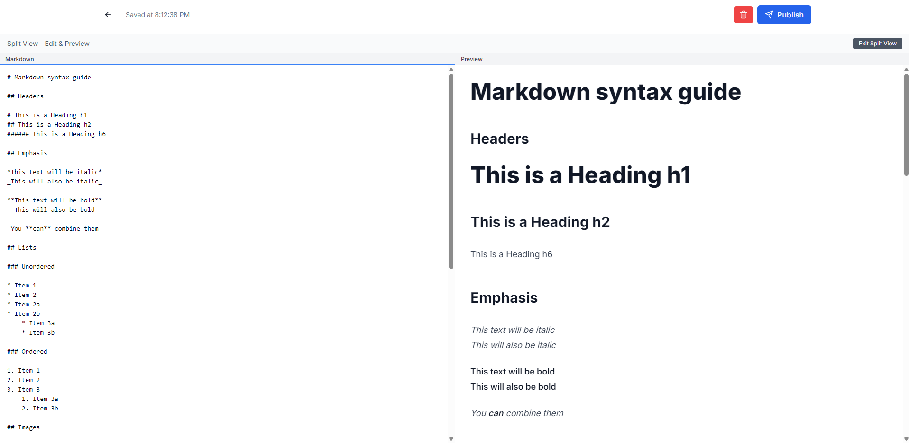

# Jekyll Chirpy CMS Panel 🚀

A modern, cloud-based CMS panel for managing [Jekyll Chirpy](https://github.com/cotes2020/jekyll-theme-chirpy) blog posts. Edit, manage, and publish your blog posts from anywhere without the need for local Jekyll installation. Hosted entirely on Vercel's free tier with seamless GitHub integration.

[](https://vercel.com/new/clone?repository-url=https://github.com/dollarboysushil/Jekyll-chirpy-cms-panel)

## ✨ Why This CMS?

**No more local editing!** This CMSsolves the pain of editing Jekyll blogs locally by providing:

- ☁️ **100% Cloud-Based** - Edit from anywhere, any device
- 🆓 **Completely Free** - Hosted on Vercel's generous free tier
- 📝 **Rich Text Editor** - Medium-style WYSIWYG editing with Tiptap
- 🖼️ **Smart Image Management** - Automatic WebP conversion & GitHub upload
- 💾 **Auto-Save** - Never lose your work (saves every 5 seconds)
- 🚀 **One-Click Publishing** - Direct publish to GitHub Pages
- 🔒 **Secure** - Token-based authentication with comprehensive security features
- 🎨 **Clean UI** - Modern, responsive design with Tailwind CSS

## 🎬 Demo


Dashboard to add, remove and manage all your posts.

Easy Markdown editor with preview, visual editor and option to paste image from clipboard

Splitview markdown editor

## 🏗️ Architecture

```
┌─────────────┐      ┌──────────────┐      ┌─────────────┐
│   Browser   │─────▶│    Vercel    │─────▶│   GitHub    │
│  (Editor)   │      │  (Next.js)   │      │   (Blog)    │
└─────────────┘      └──────────────┘      └─────────────┘
                            │
                            ├─▶ Postgres (Drafts)
                            └─▶ Blob Storage (Temp Images)
```

## 🚀 Quick Start

### Prerequisites

1. A GitHub account with a Jekyll Chirpy blog repository
2. A Vercel account (free tier)
3. That's it! No local dependencies needed.

### One-Click Deploy

1. Click the "Deploy with Vercel" button above
2. Connect your GitHub account
3. Follow the setup wizard below

### Manual Setup

#### 1. Clone & Deploy

```bash
git clone https://github.com/dollarboysushil/CMS.git
cd CMS
```

Deploy to Vercel:

```bash
npm i -g vercel
vercel
```

#### 2. Enable Vercel Postgres

1. Go to your project in [Vercel Dashboard](https://vercel.com/dashboard)
2. Navigate to **Storage** tab
3. Click **Create Database** → **Postgres**
4. Click **Connect** - This auto-injects all database environment variables

#### 3. Enable Vercel Blob Storage

1. In the same **Storage** tab
2. Click **Create** → **Blob**
3. This auto-injects `BLOB_READ_WRITE_TOKEN`

#### 4. Create GitHub Personal Access Token

1. Go to [GitHub Settings → Tokens](https://github.com/settings/tokens)
2. Click **Generate new token (classic)**
3. Name it: `Jekyll CMS Panel`
4. Select scope: ✅ **repo** (Full control of repositories)
5. Click **Generate token** and copy it

#### 5. Configure Environment Variables

Go to **Settings** → **Environment Variables** in Vercel and add:

```env
# GitHub Integration (Required)
GITHUB_TOKEN=ghp_your_token_here
GITHUB_REPO_OWNER=your-github-username
GITHUB_REPO_NAME=your-blog-repo-name

# Authentication (Required)
ADMIN_PASSWORD=your_secure_password
AUTH_SECRET=generate_with_openssl_rand_base64_32
```

**Generate AUTH_SECRET:**

```bash
openssl rand -base64 32
```

#### 6. Initialize Database

After deployment, visit:

```
https://your-app.vercel.app/api/setup
```

This creates the necessary database tables.

#### 7. Login & Start Writing!

Visit your app URL and login with your `ADMIN_PASSWORD`.

## 📖 Features in Detail

### Rich Text Editor

- **Tiptap-powered** WYSIWYG editor
- Headings, bold, italic, lists, code blocks, blockquotes
- Link insertion and editing
- Image upload via drag-and-drop or paste
- Markdown source view for power users

### Image Management

- **Automatic optimization**: WebP conversion at 85% quality
- **Smart resizing**: Max width 1200px for web performance
- **Organized structure**: Images stored in `assets/img/post_media/`
- **Temporary storage**: Uses Vercel Blob until published
- **Auto-cleanup**: Removes temp files after publishing

### Publishing Workflow

1. **Write** - Create drafts with rich text editor
2. **Preview** - See how it looks before publishing
3. **Publish** - One-click publish to GitHub
   - Converts HTML to Markdown
   - Uploads images to GitHub
   - Generates Jekyll frontmatter
   - Creates post file in `_posts/`
   - Triggers GitHub Pages rebuild

### Three Views for Every Post

- **All Posts** - See everything at a glance
- **Drafts** - Work-in-progress posts
- **Published** - Live posts on your blog

### Security Features

- JWT authentication with httpOnly cookies
- Rate limiting on all endpoints
- Input validation and sanitization
- Security headers (CSP, HSTS, etc.)
- Middleware route protection

This CMS implements multiple security layers:

- **Authentication**: JWT tokens with httpOnly cookies
- **Rate Limiting**: Prevents brute force and abuse
- **Input Validation**: Sanitizes all user inputs
- **Security Headers**: CSP, HSTS, X-Frame-Options, etc.
- **Environment Variables**: Secrets never exposed to client
- **Middleware Protection**: All routes require authentication

See [SECURITY.md](SECURITY.md) for detailed security information.

## 🔧 Tech Stack

| Category      | Technology                |
| ------------- | ------------------------- |
| **Framework** | Next.js 14 (App Router)   |
| **Language**  | TypeScript                |
| **Database**  | Vercel Postgres (Neon)    |
| **Storage**   | Vercel Blob               |
| **Editor**    | Tiptap (ProseMirror)      |
| **Styling**   | Tailwind CSS              |
| **GitHub**    | Octokit REST API          |
| **Images**    | Sharp (WebP conversion)   |
| **Markdown**  | Turndown, Unified, Remark |
| **Auth**      | JWT (Jose)                |
| **Hosting**   | Vercel (Free Tier)        |

## 📝 Development

### Local Development

```bash
# Clone repository
git clone https://github.com/dollarboysushil/CMS.git
cd CMS

# Install dependencies
npm install

# Copy environment variables
cp .env.example .env
# Edit .env with your values

# Run development server
npm run dev
```

Visit [http://localhost:3000](http://localhost:3000)

### Build for Production

```bash
npm run build
npm start
```

## 📄 License

MIT License - see [LICENSE](LICENSE) file for details

## 📧 Support

- **Issues**: [GitHub Issues](https://github.com/dollarboysushil/jekyll-chirpy-cms-panel/issues)
- **Discussions**: [GitHub Discussions](https://github.com/dollarboysushil/jekyll-chirpy-cms-panel/discussions)

---

### Creating a Post

1. Login with your admin password
2. Click "New Draft"
3. Start writing in the editor
4. Add title, slug, category, and tags
5. Upload images by dragging/dropping or clicking the image icon
6. Content auto-saves every 5 seconds
7. Click "Publish" when ready

### Publishing Flow

When you publish a post:

1. Drafts are converted from Tiptap JSON to Markdown
2. Images are uploaded to GitHub (`assets/img/posts/`)
3. Jekyll frontmatter is generated automatically
4. Post file is created in `_posts/` directory
5. Temporary images are deleted from Vercel Blob
6. Vercel auto-rebuilds your Jekyll blog

### Jekyll Frontmatter Format

```yaml
---
title: "Post Title"
date: 2025-02-15 14:30:00 +0545
categories: [Category]
tags: [tag1, tag2, tag3]
image:
  path: /assets/img/posts/slug/cover.webp
  alt: "Alt text"
---
```

**Built with ❤️ for the Jekyll Chirpy community**

**No more local editing. Write from anywhere. Deploy instantly.**
